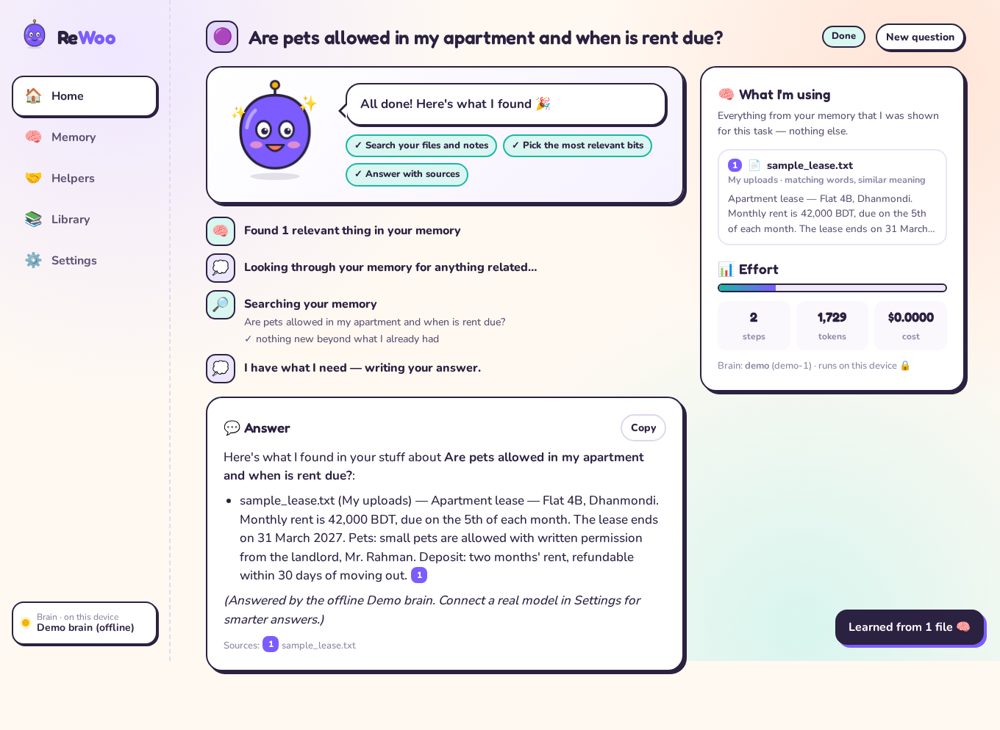

<div align="center">


# ReWoo

### Your personal AI helper that actually knows *your* stuff, and shows you exactly what it's doing.

**Private memory · Any AI model · Radically simple**

[Quick start](#-quick-start-3-minutes) · [How it works](#-how-it-works-in-plain-words) · [Use it](#-using-rewoo) · [Extend it](#-extending-rewoo) · [Architecture](docs/ARCHITECTURE.md) · [Research](RESEARCH.md)

`Apache-2.0` · `Python 3.9+` · `No Node, no Docker, no cloud account required`

</div>

---


## 🟣 What is ReWoo?

ReWoo is an **open-source Personal AI Agent OS**. In everyday words, it's an AI helper that runs on your own computer and:

- **answers from your own files**, like your notes, documents and Google Drive, and tells you which file each fact came from;
- **remembers what matters to you**, but only after asking you first;
- **does small jobs**: to-do lists, email drafts (never sent without you), notes, math, reading web pages;
- **works with any AI model**: OpenAI, Claude, Gemini, OpenRouter, Groq, or a **free, private model on your own computer** (Ollama or LM Studio);
- **shows its work live**: what it's thinking, which tool it's using, and *exactly* which pieces of your data it's looking at.

> **Technically serious underneath. Ridiculously simple on top.**

## 🤔 Why does it exist?

Open-source AI agents have become very powerful. There are "AI companies" with CEO and engineer agents, autonomous coders, agent runtimes and harnesses. We studied 36 of these projects ([RESEARCH.md](RESEARCH.md)) and found the same gap everywhere:

| What exists | What normal people still don't have |
|---|---|
| Powerful orchestration, org charts, swarms | A way to **see** what the agent is doing, in plain words |
| Memory as a roadmap item or a developer API | **Private personal memory** you can inspect, limit and erase |
| One favourite model provider | **Model freedom**, including local models for sensitive data |
| Terminals, YAML, Docker, `.env` files | A **friendly app** a non-technical person can use in 3 minutes |
| "Trust me" automation | **Consent**: it asks before remembering things or taking risky actions |

ReWoo is that missing layer: **agent infrastructure + private memory + context engineering + model freedom + a radically simple human experience.**

## 🚀 Quick start (3 minutes)

You need **Python 3.9 or newer** ([download](https://www.python.org/downloads/)). That's it.

```bash
# 1. Get the code
git clone https://github.com/AdilShamim8/rewoo.git
cd rewoo

# 2. Install (one time)
python3 -m pip install -r requirements.txt

# 3. Start ReWoo
python3 -m rewoo
```

Your browser opens **http://localhost:8787**. Woo says hi and walks you through setup.

<details>
<summary><b>Windows users</b></summary>

Use `py` instead of `python3`:

```powershell
py -m pip install -r requirements.txt
py -m rewoo
```
</details>

<details>
<summary><b>Prefer Docker?</b></summary>

```bash
docker compose up --build     # then open http://localhost:8787
```
</details>

**No API key? No problem.** ReWoo starts with an offline **Demo brain**, so you can try every screen straight away. Connect a real AI in **Settings → Brains** when you're ready:

| Brain | Cost | Privacy | How |
|---|---|---|---|
| **Ollama** (Llama, Qwen, Gemma…) | Free | 🔒 Stays on your computer | Install [ollama.com](https://ollama.com), run `ollama pull llama3.2`, then add "Ollama" in Settings |
| **OpenAI / Claude / Gemini** | Pay per use | Sent to the provider | Paste your API key in Settings |
| **OpenRouter / Groq / any OpenAI-compatible server** | Varies | Varies | Paste the key and server address |

## 🧠 How it works (in plain words)

```
   Your stuff                     ReWoo                                  You
┌──────────────┐   pick only   ┌────────────────────────────┐   live   ┌──────────────────┐
│ Files        │──the relevant▶│ 1. Find what's relevant     │──────────▶│ See every step   │
│ Google Drive │    pieces     │ 2. Hide secrets, respect 🔒 │           │ See what it used │
│ Notes        │               │ 3. Think with your chosen AI│◀──────────│ Say yes / no     │
│ Past chats   │◀──remember────│ 4. Use tools, ask if risky  │  approve  │ Get the answer   │
│ Facts you OK │  (with OK)    │ 5. Answer with sources      │           │ with sources     │
└──────────────┘               └────────────────────────────┘           └──────────────────┘
```

1. **You ask** something, like *"Are pets allowed in my apartment?"*
2. **ReWoo searches your memory** and picks just the few most relevant pieces. It never dumps everything into the AI.
3. **It protects you.** Passwords and API keys are hidden before anything leaves your computer. Sources you've marked **Private 🔒** are only ever shown to AI models running on your own machine.
4. **It thinks and acts.** Your chosen AI decides what to do next: search more, read a document, do math, add a to-do. Anything that changes your memory (or anything risky) **waits for your OK**.
5. **It answers with sources** like **[1]**. Click one to see exactly where the answer came from.
6. **It learns.** Finished conversations become memory, so next time it knows your context.

The panel on the right of every task, **"What I'm using"**, is a *context receipt*. It lists every piece of your data the AI was shown, plus what was **left out and why**, and how many secrets were hidden.



## 🧭 Using ReWoo

| Screen | What you do there |
|---|---|
| **🏠 Home** | Ask anything. Pick a helper. One-click **Recipes** like "Brief me on a topic", "Plan my week" and "Draft a reply". |
| **🧠 Memory** | Upload files, connect **Google Drive**, choose what ReWoo may use, mark sources **Private 🔒**, see and forget facts, pause all memory, and **Peek** at what ReWoo would see for any question. |
| **🤝 Helpers** | Meet the team: **Woo** (everyday), **Scout** (research), **Quill** (writing), **Tally** (numbers and plans), **Hush** (private, on-device only). You can make your own in 30 seconds. |
| **📚 Library** | To-dos, notes and email drafts your helpers made. Drafts are **never sent**: copy them or open them in your email app. |
| **⚙️ Settings** | Brains (AI models), backup brains, when to ask first (*Careful / Balanced / Autopilot*), and per-task limits for steps, tokens and cost. |

**Try these:**

- *"What do my notes say about the trip budget?"*
- *"Remember that I'm allergic to peanuts"* (you'll be asked first)
- *"Remind me to renew my passport"*
- *"Draft an email to my landlord about the broken heater"*
- *"Summarize https://example.com in 5 bullets"*

### Connecting Google Drive

Memory → Google Drive → follow the 4 on-screen steps (about 5 minutes, one time only). ReWoo uses **read-only** access and only reads the folders you tick. Full guide: [docs/GOOGLE_DRIVE.md](docs/GOOGLE_DRIVE.md).

## 🔐 Privacy, in one table

| Promise | How it's enforced |
|---|---|
| Your data stays on your computer | One local SQLite file (`data/rewoo.db`). No ReWoo cloud exists. |
| Only relevant bits go to the AI | Retrieval plus a token budget per task (`ContextBuilder`) |
| Private sources never leave your machine | Router refuses remote brains when private data is in the prompt |
| Secrets are hidden | API keys, passwords, card-like numbers and private keys are redacted before remote calls |
| Nothing is remembered without consent | `remember_fact` is an approval-gated tool |
| Nothing is sent on your behalf | Email is draft-only. There is no "send" tool. |
| You can always see and undo | Context receipts, per-source toggles, forget buttons, and a pause-all switch |

## 🧩 Extending ReWoo

ReWoo is small and readable on purpose. Common extensions take minutes:

- **Add a tool**: one async function plus a decorator ([examples/custom_tool.py](examples/custom_tool.py))
- **Add a recipe**: drop a JSON file into `data/recipes/` ([examples/custom_recipe.json](examples/custom_recipe.json))
- **Add a brain**: any OpenAI-compatible server works from Settings. A new API type is one class with `complete()`.
- **Add a memory source**: call `memory.add_document(...)`. See `connectors/gdrive.py` for a full connector.
- **Script it**: everything is an HTTP API ([examples/api_quickstart.py](examples/api_quickstart.py)), plus a CLI: `python3 -m rewoo ask "…"`

Full guide: [docs/EXTENDING.md](docs/EXTENDING.md).

## 🧪 Tests and evaluation harness

```bash
python3 -m pip install -r requirements-dev.txt
python3 -m pytest -q          # unit + integration tests (no network, no API keys)
python3 -m rewoo eval         # behaviour scenarios: grounding, honesty, consent, privacy, secrets, math, drafts
python3 -m rewoo trace <id>   # replay any task step by step from its event log
```

The eval harness runs each scenario in a fresh, isolated ReWoo against the Demo brain, so results are reproducible in CI. Point it at a real brain to benchmark models on the same checks.

## 🗂️ Project structure

```
rewoo/
├── rewoo/
│   ├── agent/        # runtime loop, JSON protocol, helpers (roles)
│   ├── models/       # provider interface, adapters (OpenAI-compat, Anthropic, Gemini, Ollama, Demo), router
│   ├── memory/       # sources → documents → chunks, hybrid search, context builder + receipts, redaction
│   ├── connectors/   # Google Drive (read-only, incremental)
│   ├── tools/        # tool registry + risk levels, built-in tools
│   ├── recipes/      # one-click workflows (JSON)
│   ├── harness/      # eval runner, scenarios, trace replay
│   ├── api/          # FastAPI app + live event streaming (SSE)
│   ├── web/          # the app UI (plain HTML/CSS/JS, no build step)
│   ├── core.py       # wires everything together
│   └── db.py         # SQLite store (+ FTS5 full-text index)
├── tests/            # pytest suite
├── examples/         # sample notes, custom tool/recipe, API quickstart
├── docs/             # architecture, Google Drive, extending, screenshots
├── RESEARCH.md       # what we learned from 36 agent projects
└── ATTRIBUTION.md    # licenses and credits
```

## 🗺️ Roadmap

- Scheduled helpers ("every Monday, brief me on…"), with the same approvals
- More connectors: Gmail (read-only), Notion, local folders watch, calendar
- MCP tool import, so any MCP server becomes ReWoo tools with risk levels
- "Lessons learned": turn repeated corrections into pinned facts, with your OK
- Voice input and a mobile-friendly PWA

## 🤝 Contributing

Issues and pull requests are welcome. See [CONTRIBUTING.md](CONTRIBUTING.md). Please keep the two design rules in mind: **anything new must be explainable to a non-technical person**, and **anything that touches personal data must be visible in the context receipt.**

## 📜 License and credits

ReWoo is licensed under the **Apache License 2.0**. See [LICENSE](LICENSE) and [NOTICE](NOTICE).

ReWoo is an independent implementation. It was informed by studying many open-source agent projects, but it contains no code, assets or UI copied from them. See [ATTRIBUTION.md](ATTRIBUTION.md).

**Author:** [Adil Shamim](https://adilshamim.me) · [GitHub](https://github.com/AdilShamim8) · [LinkedIn](https://linkedin.com/in/adilshamim8)

> ReWoo is an early-stage open-source project (v0.1). It is not yet audited for high-stakes use. Please don't rely on it for medical, legal or financial decisions.
