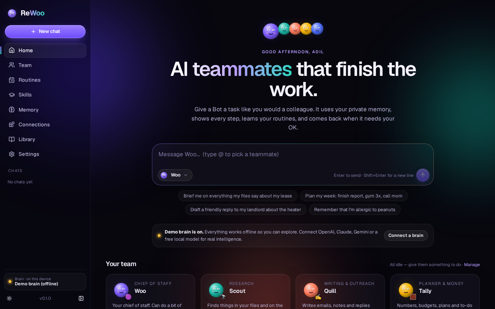
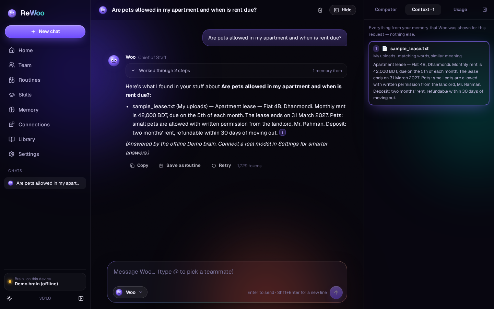
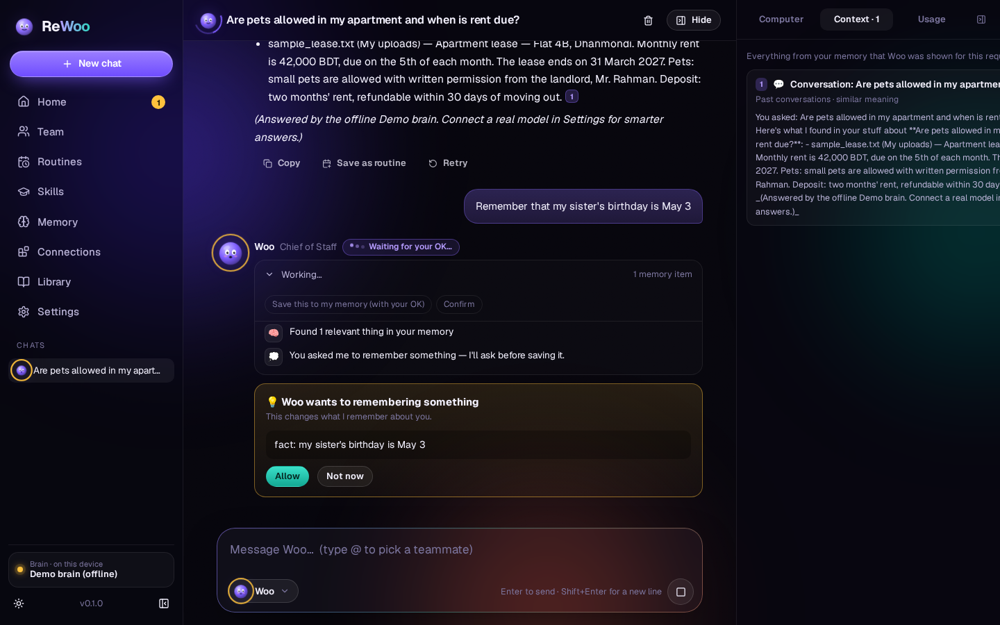
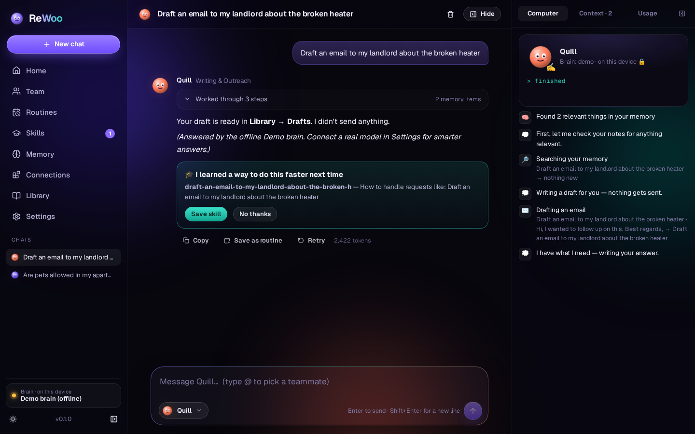
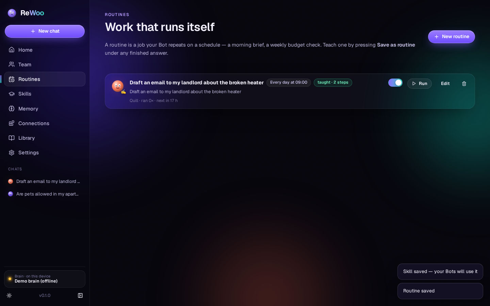
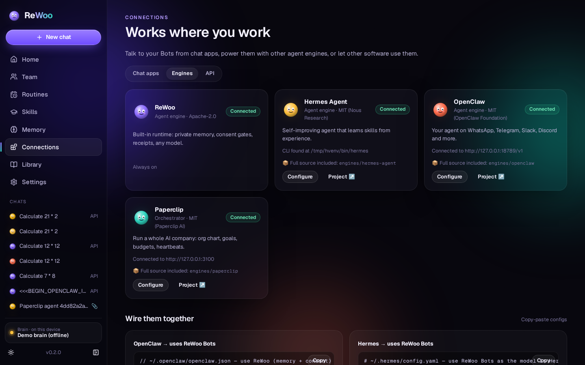
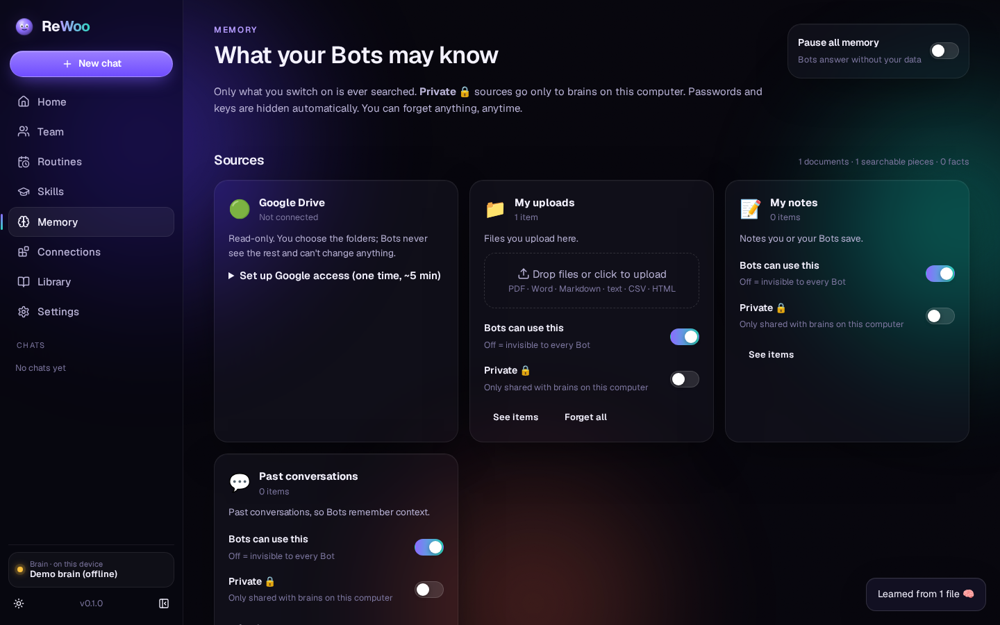
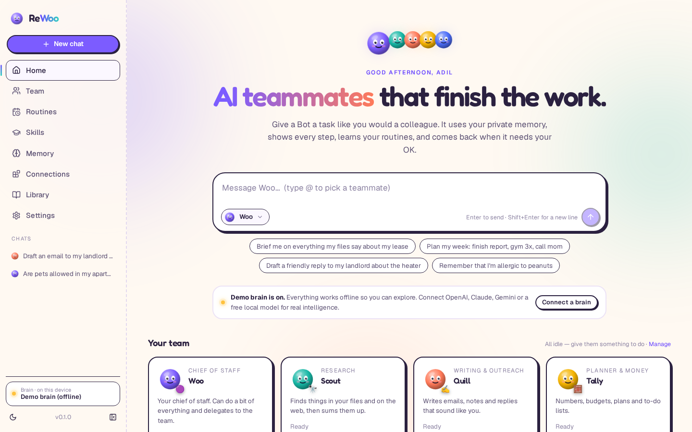
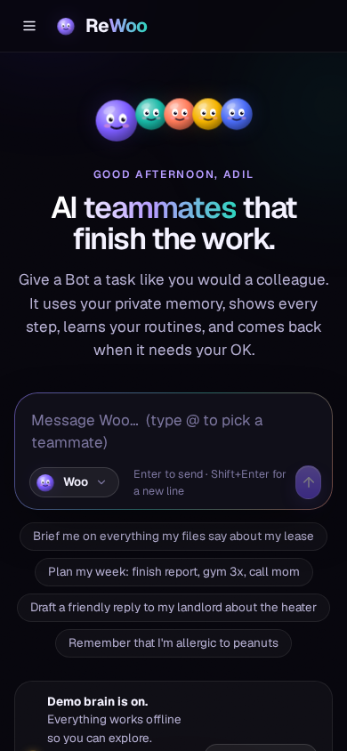

<div align="center">


# ReWoo

### AI teammates that finish the work, and only ever use the parts of your life you allow.

**Private memory · Any AI model · Routines · Skills that grow · Works in your chat apps**

ReWoo merges three of the most important open-source agent projects into **one simple app**:
<br/>**[Paperclip](https://github.com/paperclipai/paperclip)** (the team) · **[Hermes Agent](https://github.com/NousResearch/hermes-agent)** (the learning) · **[OpenClaw](https://github.com/openclaw/openclaw)** (works where you work)
<br/>and adds the layer they all miss: **private personal memory, consent and a UI anyone can use.**

[Quick start](#-quick-start-3-minutes) · [Tour](#-a-2-minute-tour) · [How it works](#-how-it-works) · [Engines](#-the-three-engines) · [Privacy](#-privacy-promises) · [Develop](#-for-developers) · [Docs](docs/)

`Apache-2.0` · `Python 3.9–3.14` · `Windows · macOS · Linux` · `No Node needed to run`

</div>

---



## 🟣 What is ReWoo?

ReWoo gives you a **team of AI Bots** you message like colleagues:

| Bot | Job | Good at |
|---|---|---|
| 🟣 **Woo** | Chief of Staff | A bit of everything; hands work to the right teammate |
| 🔭 **Scout** | Research | Finds things in your files and on the web, with sources |
| ✍️ **Quill** | Writing & Outreach | Drafts emails and notes in your voice (never sends) |
| 🧮 **Tally** | Planner & Money | Exact math, budgets, plans, to-dos |
| 🔒 **Hush** | Private matters | Only thinks with AI running on *your* computer |

…plus any Bot you create. Each one can run on ReWoo's own engine, on **Hermes Agent**, or on **OpenClaw**.

- **It knows your stuff.** Upload files or connect **Google Drive**. Bots answer from *your* documents and show exactly which ones.
- **You watch it work.** Every step, every tool and every piece of memory used is shown live on the Bot's "Computer" panel.
- **It asks first.** Remembering something about you, going online, anything risky: you get **Allow / Not now**.
- **It learns.** After real work, a Bot proposes a reusable **skill**, and you decide whether it keeps it. You can also import 200+ skills from Hermes Agent.
- **It runs on a schedule.** Press **Save as routine** under any answer and it repeats every morning, or whenever you like.
- **It works where you are.** Use the app, **Telegram** (built in), or WhatsApp, Slack, Discord and 20+ more through OpenClaw.
- **Any brain.** OpenAI, Claude, Gemini, OpenRouter, Groq, or **free and private** local models (Ollama, LM Studio). An offline Demo brain means it works the moment you install it.

## 🚀 Quick start (3 minutes)

You need **Python 3.9 or newer** ([download](https://www.python.org/downloads/)). That's all. The web app ships prebuilt.

```bash
git clone https://github.com/AdilShamim8/rewoo.git
cd rewoo
python3 -m pip install -r requirements.txt
python3 -m rewoo
```

Your browser opens **http://localhost:8787** and a short intro introduces your team.

<details><summary><b>Windows</b></summary>

```powershell
py -m pip install -r requirements.txt
py -m rewoo
```
</details>

<details><summary><b>Docker</b></summary>

```bash
docker compose up                      # ReWoo
docker compose --profile engines up    # ReWoo + Paperclip + Hermes Agent
```
</details>

**Connect a real brain** in **Settings → Brains** (paste an API key, or pick *Ollama* for free, private AI on your computer). Until then the offline **Demo brain** lets you try every feature.

## 🎬 A 2-minute tour

| | |
|---|---|
|  **Chat with a Bot.** The answer streams in, with sources like **[1]**. Click one to see exactly what was used. |  **Consent built in.** "Remember that…" waits for your OK, and so does anything risky. |
|  **Bots get smarter.** After multi-step work, a Bot proposes a skill. Save it, and next time it's faster. |  **Teach a task once.** *Save as routine* turns any answer into scheduled work. |
|  **Three engines, one app.** Hermes, OpenClaw and Paperclip, all connected and verified live. |  **Your memory, your rules.** Toggle sources, mark them Private 🔒, forget anything. |

<p align="center"> </p>
<p align="center"><sub>Night & Day themes · works on phones</sub></p>

## 🧠 How it works

```
 You ──► a Bot ──► 1. picks only the relevant bits of YOUR memory (files · Drive · notes · past chats · facts)
                   2. hides passwords/keys; keeps Private 🔒 data on this computer
                   3. thinks with the brain you chose, using skills it learned
                   4. uses tools (search, math, notes, to-dos, drafts, web, teammates)
                      └─ anything risky → "Can I…?"  Allow / Not now
                   5. streams the answer with sources + a receipt of everything it used
                   6. remembers the conversation; proposes a skill; can repeat it as a routine
```

| Idea | Where it comes from | What ReWoo adds |
|---|---|---|
| A **team** of specialised agents with jobs, hand-offs, heartbeats | Paperclip's AI company | Friendly Bots instead of an org chart; routines instead of cron |
| **Learning loop** that turns experience into `SKILL.md` skills | Hermes Agent | Consent: skills are *proposed*, you approve; same file format, so they interoperate |
| **Gateway** to chat apps with DM pairing | OpenClaw | Native Telegram channel with pairing codes; OpenClaw for everything else |
| **Private memory + context engineering** | ReWoo | Hybrid search, token-budgeted context, secret redaction, private-source routing, receipts |

Architecture details: **[docs/ARCHITECTURE.md](docs/ARCHITECTURE.md)**.

## 🧩 The three engines

ReWoo includes the **complete source** of all three projects in [`engines/`](engines/README.md) (MIT, with notices kept), wired in through their real interfaces. **Every integration below was run live**:

| | Direction | What you get |
|---|---|---|
| **Hermes Agent** | Hermes → ReWoo | Hermes uses your ReWoo Bots (with memory and consent) as its model |
| | ReWoo → Hermes | A ReWoo Bot runs on Hermes (API server or CLI) |
| | Skills | Import Hermes' 200+ bundled skills in one click |
| **OpenClaw** | OpenClaw → ReWoo | WhatsApp/Slack/Discord/Telegram… messages reach your ReWoo Bots |
| | ReWoo → OpenClaw | A ReWoo Bot runs on an OpenClaw agent |
| **Paperclip** | Paperclip → ReWoo | Hire a ReWoo Bot into your company. Assign it an issue, and it does the work, comments the result and closes the issue |
| | ReWoo → Paperclip | See your company's agents and issues, create and assign issues, wake agents |

Step-by-step setup, copy-paste configs and the verification log: **[docs/ENGINES.md](docs/ENGINES.md)**.

## 🔐 Privacy promises

| Promise | How it's enforced |
|---|---|
| Your data stays on your computer | One local SQLite file (`data/rewoo.db`). There is no ReWoo cloud. |
| Bots only see what's relevant | Hybrid retrieval plus a per-task token budget. You see a receipt every time. |
| Private sources never leave your machine | Remote brains and engines are refused whenever private data is in the prompt |
| Secrets are hidden | API keys, passwords, card-like numbers and private keys are redacted before remote calls |
| Nothing is remembered without consent | Saving to memory is approval-gated, and skills are proposed rather than auto-installed |
| Nothing is sent on your behalf | Emails are drafts only. There is no "send" tool. |
| Other apps need a key | `/v1` requires your ReWoo API key. `REWOO_ACCESS_TOKEN` can lock the whole app. |

Security details and reporting: [SECURITY.md](SECURITY.md).

## 🛠️ For developers

```bash
python3 -m pip install -r requirements-dev.txt
python3 -m pytest -q        # 131 backend tests (offline, no API keys)
python3 -m rewoo eval       # behaviour scenarios: grounding, honesty, consent, privacy, secrets…
python3 -m rewoo trace <id> # replay any task step by step
make web-dev                # hot-reload UI (React + TypeScript + Vite) on :5173
make web                    # rebuild the prebuilt UI into rewoo/web/dist
```

**Use ReWoo from anything** that speaks the OpenAI API:

```bash
curl http://localhost:8787/v1/chat/completions -H "Authorization: Bearer $REWOO_API_KEY" \
  -H "Content-Type: application/json" -d '{"model":"rewoo/scout","messages":[{"role":"user","content":"Brief me on my lease"}]}'
```

**Extend it:** add a tool (one function), a recipe (one JSON file), a brain (one class), a memory
connector, a Bot or an eval scenario. See **[docs/EXTENDING.md](docs/EXTENDING.md)**.

```
rewoo/                 Python package (FastAPI + SQLite)
  agent/               runtime · protocol · bots · threads · skills · routines
  models/              provider interface · OpenAI-compat · Anthropic · Gemini · Ollama · Demo · router
  memory/              sources → chunks · hybrid search · context builder + receipts · redaction
  engines/             Hermes / OpenClaw / Paperclip adapters
  channels/            Telegram connector
  connectors/          Google Drive (read-only, incremental)
  api/                 REST · live SSE · OpenAI-compatible /v1
  web/dist/            prebuilt web app
web/                   web app source (React + TS + Vite + Framer Motion)
engines/               full vendored source: hermes-agent · paperclip · openclaw
tests/ · docs/ · examples/ · scripts/
```

## 📤 Publish this repo to GitHub

The vendored engines keep their own `.gitignore` files, so use the helper. It force-adds `engines/` so nothing is dropped:

```bash
scripts/publish-to-github.sh https://github.com/<you>/rewoo.git        # macOS / Linux
.\scripts\publish-to-github.ps1 https://github.com/<you>/rewoo.git     # Windows
```

## 📜 License and credits

ReWoo is **Apache-2.0** ([LICENSE](LICENSE), [NOTICE](NOTICE)). The vendored engines are **MIT**, and their license texts are in [THIRD_PARTY_NOTICES.md](THIRD_PARTY_NOTICES.md) and inside each folder. See [ATTRIBUTION.md](ATTRIBUTION.md) for how ideas and code from 36 studied projects were used.
The ReWoo UI, mascot, name and visual design are original. No third-party UI, logos, fonts or branding are used in ReWoo itself. See [TRADEMARKS.md](TRADEMARKS.md).

**Author:** [Adil Shamim](https://adilshamim.me) · [GitHub](https://github.com/AdilShamim8) · [LinkedIn](https://linkedin.com/in/adilshamim8)

> ReWoo is an early open-source project (v0.2). It hasn't been audited for high-stakes use, so please don't rely on it for medical, legal or financial decisions.
